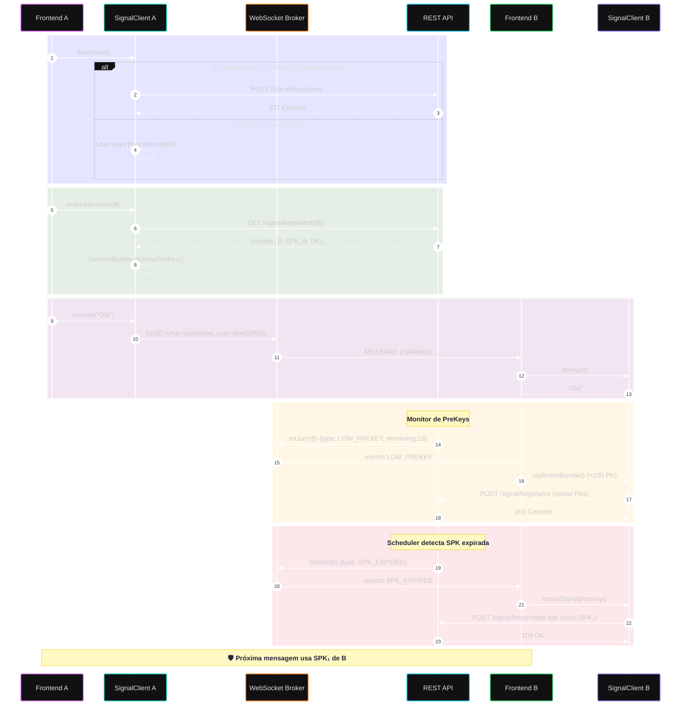

<h1 align=center>DevChat-Api</h1>

## *🗺️ Diagramas*

### *🔒🔑 Arquitetura E2EE (Signal)*

Este diagrama ilustra o fluxo completo de comunicação **fim-a-fim criptografada** implementado na nossa API usando o protocolo Signal:

- Mostra como o cliente gera e publica chaves na primeira inicialização (ou quando o storage local é perdido).
- Descreve o handshake de sessão entre usuários, com fetch seguro de bundles.
- Explica o envio de mensagens cifradas via WebSocket, totalmente opacas ao servidor.
- Detalha como o backend monitora **pre-keys** e **signedPreKeys**, enviando alertas automáticos para reposição ou rotação.
- Representa a segurança baseada em **IndexedDB local** com _trust-on-first-use_.

---

---

## *🖥️ Tech Stack*

### *👨‍💻 Technologies*

<table align="center" width=1000px>
    <thead>
        <tr>
            <th></th>
            <th></th>
            <th></th>
            <th></th>
            <th></th>
            <th></th>
            <th></th>
        </tr>
    </thead>
    <tbody align="center">
        <tr>
            <td>MySQL</td>
            <td>Hibernate</td>
            <td>Spring Boot</td>
            <td>Java</td>
            <td>Redis</td>
            <td>JWT</td>
            <td>WebSocket</td>
        </tr>
        <tr>
            <td>🔖 8.1.0</td>
            <td>🔖 6.3</td>
            <td>🔖 3.3.2</td>
            <td>🔖 17</td>
            <td>🔖 7.4.2</td>
            <td>🔖 0.12.6</td>
            <td>🔖 3.4.2</td>
        </tr>
    </tbody>
</table>

---

### *🛠️ Development Tools*

<table align="center" width=1000px>
    <thead>
        <tr>
            <th></th>
            <th></th>
            <th></th>
            <th></th>
            <th></th>
            <th></th>
        </tr>
    </thead>
    <tbody align="center">
        <tr>
            <td>IntelliJ IDEA</td>
            <td>DataGrip</td>
            <td>Postman</td>
            <td>Docker</td>
            <td>Maven</td>
            <td>GitHub Actions</td>
        </tr>
        <tr>
            <td>🔖 2024.3.2</td>
            <td>🔖 2024.3</td>
            <td>🔖 11.32.1</td>
            <td>🔖 27.5.1</td>
            <td>🔖 3.9.6</td>
            <td>🔖 - </td>
        </tr>
    </tbody>
</table>

---

### *☁️ Cloud Services*

<table align="center" width=1000px>
    <thead>
        <tr>
            <th></th>
            <th></th>
            <th></th>
        </tr>
    </thead>
    <tbody align="center">
        <tr>
            <td>AWS S3</td>
            <td>AWS SES</td>
            <td>AWS CloudWatch</td>
        </tr>
    </tbody>
</table>

---

### *🧪 Testing & QA*

<table align="center" width=1000px>
    <thead>
        <tr>
            <th></th>
            <th></th>
            <th></th>
            <th></th>
            <th></th>
        </tr>
    </thead>
    <tbody align="center">
        <tr>
            <td>Swagger</td>
            <td>Cucumber</td>
            <td>JUnit</td>
            <td>ArchUnit</td>
            <td>TestContainers</td>
        </tr>
        <tr>
            <td>🔖 2.8.5 </td>
            <td>🔖 7.21.1 </td>
            <td>🔖 5 </td>
            <td>🔖 1.4.0 </td>
            <td>🔖 1.20.4 </td>
        </tr>
    </tbody>
</table>
